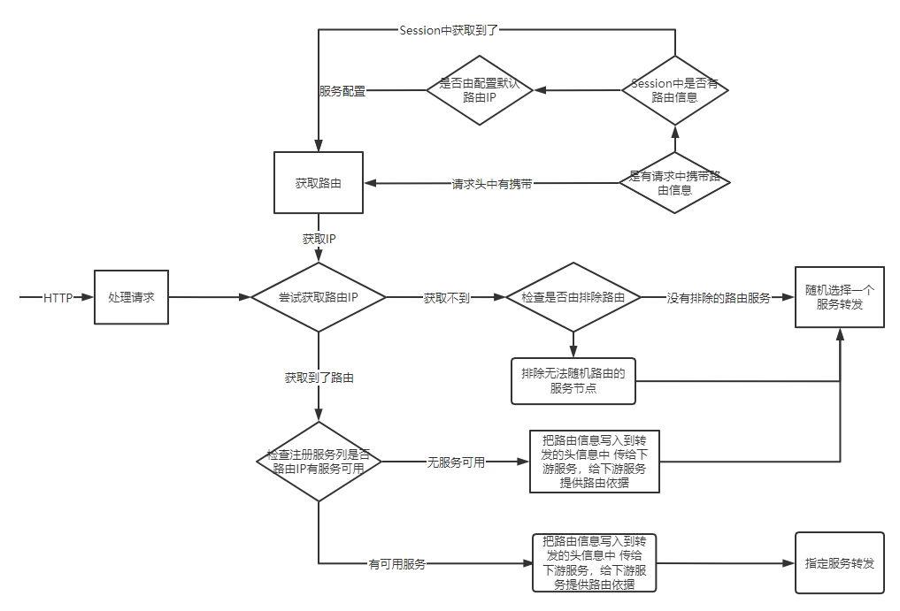

## RibbonSupport

### 简介

```text

```

### 实现流程



### 快速开始

- 添加仓库信息

```xml

<repositories>
    <repository>
        <id>my-public</id>
        <name>my-public</name>
        <url>http://maven.onetozero.cn/repository/maven-public/</url>
    </repository>
</repositories>
```

- 添加maven坐标

```xml

<dependency>
    <groupId>com.xwc.support</groupId>
    <artifactId>ribbon-support</artifactId>
    <version>1.0-SNAPSHOT</version>
</dependency>
```

- 开启路由

```yaml
ribbon:
  support:
    ip-rule:
      enable: true  #开启优先IP路由配置
      exclude-ip-regex: '^10\.27\.(5|7|8|9|10)\.[0-9]{1,3}$'  # 无法随机路由的网段 只能通过IP路由、默认路由来访问
      default-ip: 10.27.12.191  # 默认路由

```